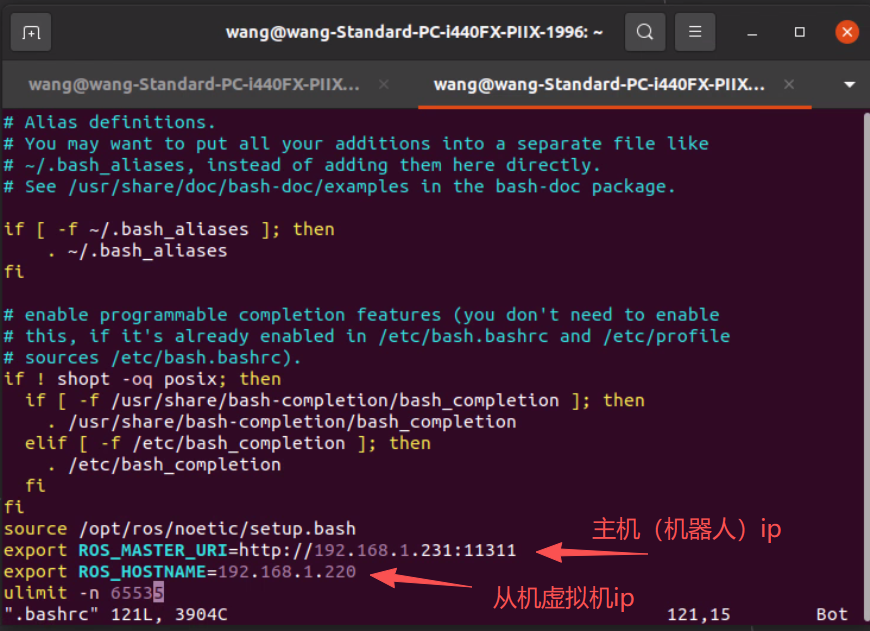

# fnos_ubuntu2004
1. git仓库：这个仓库主要同步fnos_ubuntu2004虚拟机中的代码，因为虚拟机存在崩溃的可能性。

2. 虚拟机：这个虚拟主要是为了wheeltec机器人开发而创建。
   1. 虚拟机安装了ubuntu20.04系统，ros版本noetic,专门为机器人开发搭建环境。
   2. 为方便在环境崩溃时能够迅速重新搭建环境，继续搭建环境步骤：
      1. 安装官方ubuntu镜像
      2. 安装开发软件均在nas/share/常用软件/ubuntu目录下；另外除了通过安装包安装的软件之外，还有在线安装的工具：ros ssh。额外进行的配置：
         1. 为了使用ros1与机器人进行多机通讯，把小车作为主机，虚拟机作为从机，配置如下：
         
      3. 所有的开发文件都在fnos_ubuntu2004目录下，不会再其他地方放需要备份的文件。该文件回定期上传至nas/share/fnos_xuniji_back/fnos_ubuntu2004。

3. 机器人上位机：
   1. 机器人已经自动连接上了家里局域网WiFi因此可以通过SSH远程登录机器人上位机主控：ip:192.168.1.231 用户名：wheeltec 密码：dongguan
   2. 机器人上位机ubuntu版本：18.04，ROS版本：melodic
   3. 机器人上位机主控关键文件路径以及说明：
      1. /home/wheeltec/wyb: 
         wyb   //存放自己单独测试的ros包：
         └── work_space
            └── src
                  ├── turn_on_wheeltec_robot //机器人底盘ros包以及相关介绍
                  └── ros_astra_camera //奥比中光相机ros包

      2. /home/wheeltec/wheeltec_robot //机器人导航包含的功能包
         wheeltec_robot
         ├── build
         ├── devel
         ├── src
         │   ├── CMakeLists.txt -> /opt/ros/melodic/share/catkin/cmake/toplevel.cmake
         │   ├── depthimage_to_laserscan-melodic-devel
         │   ├── fdilink_ahrs
         │   ├── imu_tf_broadcaster
         │   ├── ipa_exploration
         │   ├── kcf_track
         │   ├── navigation-melodic
         │   ├── robot_pose_ekf
         │   ├── ros_astra_camera
         │   ├── ROS常用功能命令6.0.txt
         │   ├── rrt_exploration
         │   ├── sh_manager
         │   ├── simple_follower
         │   ├── slam_karto
         │   ├── teb_local_planner-melodic-devel
         │   ├── tts_make
         │   ├── turn_on_wheeltec_robot
         │   ├── usb_cam
         │   ├── web_video_server
         │   ├── wheeltec_joy_control
         │   ├── wheeltec_lidar
         │   ├── wheeltec_multi
         │   ├── wheeltec_robot_rc
         │   ├── world_canvas_msgs
         │   ├── xf_mic_asr_offline_circle
         │   └── yesense_imu
         └── src.zip

