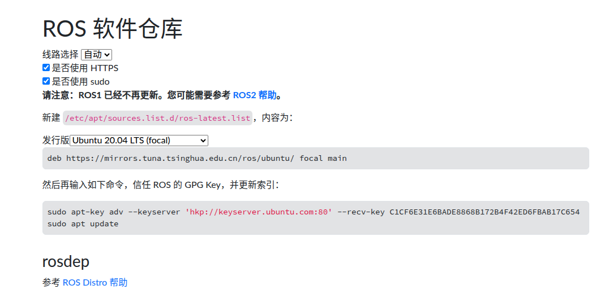
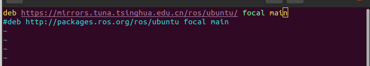
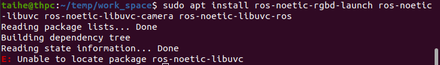
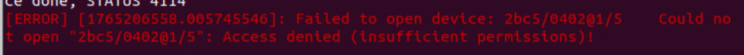
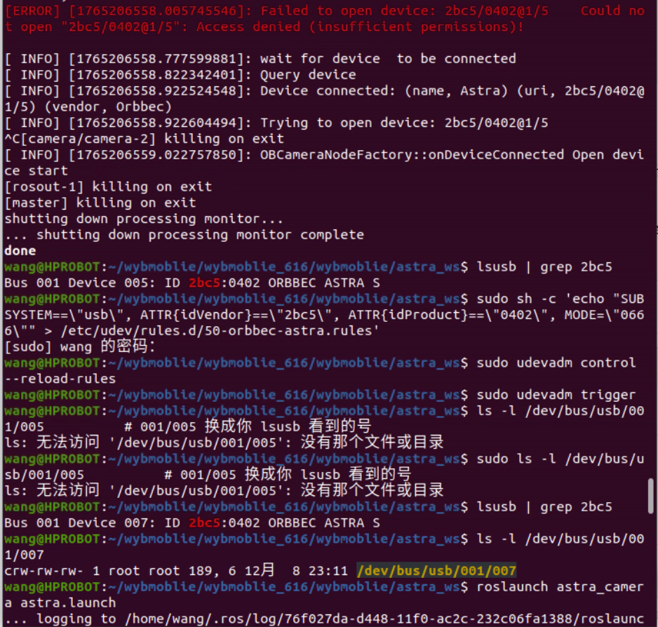
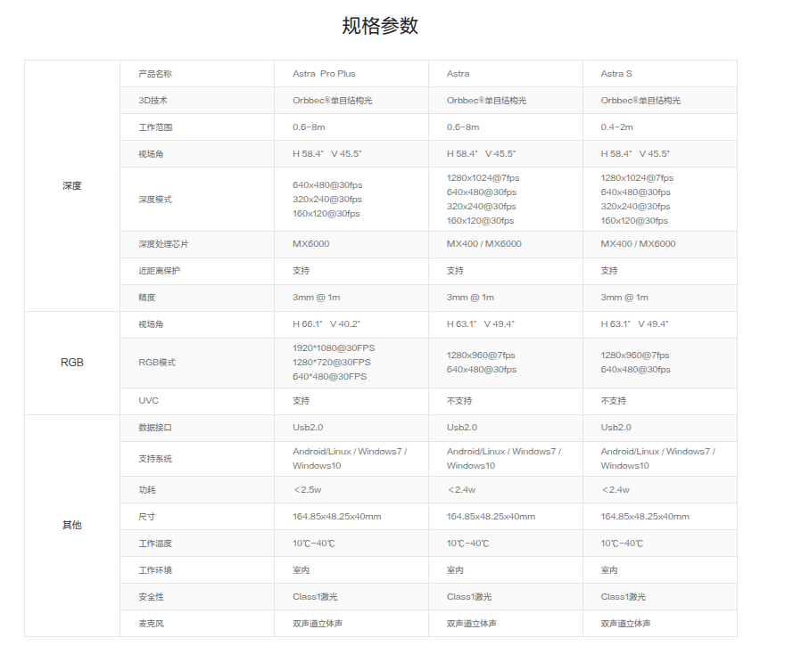

1. 该ros包来源：wheeltec830提供的资料包中
2. 使用：先阅读README
3. 本文件记录使用过程中的问题
    1. 安装依赖时报错：
        ```
        taihe@thpc:~/temp/work_space$ sudo apt install ros-noetic-rgbd-launch
        [sudo] password for taihe: 
        Reading package lists... Done
        Building dependency tree       
        Reading state information... Done
        E: Unable to locate package ros-noetic-rgbd-launch
        ```
        解决：
        添加清华镜像源,进入https://mirror.tuna.tsinghua.edu.cn/help/ros/ 按照提示更新索引即可  
        若/etc/apt/sources.list.d/ros-latest.list已经存在，
        注释掉原来的修改为清华镜像中的即可。
        
        
    2. 安装依赖报错如下图  
        

        解决：  
        Ubuntu 20.04 / ROS Noetic 的 官方 apt 仓库里根本没有 ros-noetic-libuvc 这个包——它从未被 Release 过。（很多教程把 4 个包写在一起，但第 2 个 libuvc 是多余的。）

    3. 运行报错：
          
        解决：  
        
        ```
        wang@HPROBOT:~/wybmoblie/wybmoblie_616/wybmoblie/astra_ws$ lsusb | grep 2bc5
        Bus 001 Device 005: ID 2bc5:0402 ORBBEC ASTRA S
        wang@HPROBOT:~/wybmoblie/wybmoblie_616/wybmoblie/astra_ws$ sudo sh -c 'echo "SUBSYSTEM==\"usb\", ATTR{idVendor}==\"2bc5\", ATTR{idProduct}==\"0402\", MODE=\"0666\"" > /etc/udev/rules.d/50-orbbec-astra.rules'
        [sudo] wang 的密码： 
        wang@HPROBOT:~/wybmoblie/wybmoblie_616/wybmoblie/astra_ws$ sudo udevadm control --reload-rules
        wang@HPROBOT:~/wybmoblie/wybmoblie_616/wybmoblie/astra_ws$ sudo udevadm trigger
        wang@HPROBOT:~/wybmoblie/wybmoblie_616/wybmoblie/astra_ws$ ls -l /dev/bus/usb/001/005          # 001/005 换成你 lsusb 看到的号
        ls: 无法访问 '/dev/bus/usb/001/005': 没有那个文件或目录
        wang@HPROBOT:~/wybmoblie/wybmoblie_616/wybmoblie/astra_ws$ sudo ls -l /dev/bus/usb/001/005          # 001/005 换成你 lsusb 看到的号
        ls: 无法访问 '/dev/bus/usb/001/005': 没有那个文件或目录
        wang@HPROBOT:~/wybmoblie/wybmoblie_616/wybmoblie/astra_ws$ lsusb | grep 2bc5
        Bus 001 Device 007: ID 2bc5:0402 ORBBEC ASTRA S
        wang@HPROBOT:~/wybmoblie/wybmoblie_616/wybmoblie/astra_ws$ ls -l /dev/bus/usb/001/007
        crw-rw-rw- 1 root root 189, 6 12月  8 23:11 /dev/bus/usb/001/007
        wang@HPROBOT:~/wybmoblie/wybmoblie_616/wybmoblie/astra_ws$ roslaunch astra_camera astra.launch 
        ... logging to /home/wang/.ros/log/76f027da-d448-11f0-ac2c-232c06fa1388/roslaunch-HPROBOT-9688.log
        Checking log directory for disk usage. This may take a while.
        Press Ctrl-C to interrupt
        Done checking log file disk usage. Usage is <1GB.

        started roslaunch server http://HPROBOT:36365/

        ```
        Astra S “Access denied (insufficient permissions)” 问题速查表  
        （USB VID=2bc5 PID=0402，同样适用于任何出现该报错的 2bc5:0402 设备）

        1. 确认设备被识别  
        `lsusb | grep 2bc5`  
        记录 Bus XXX Device YYY 号（重启/重插后会变，仅临时参考）。

        2. 一次写入 udev 规则（永久生效）  
        ```bash
        sudo sh -c 'echo "SUBSYSTEM==\"usb\", ATTR{idVendor}==\"2bc5\", ATTR{idProduct}==\"0402\", MODE=\"0666\"" > /etc/udev/rules.d/50-orbbec-astra.rules'
        ```

        3. 重载规则 & 触发  
        ```bash
        sudo udevadm control --reload-rules
        sudo udevadm trigger
        ```

        4. 重新插拔相机（或重启电脑）。

        5. 验证  
        再次 `lsusb | grep 2bc5` 找到新的 Device 号，  
        `ls -l /dev/bus/usb/XXX/YYY` 应显示 `rw-rw-rw-`（0666）。

        6. 启动 ROS 节点  
        `roslaunch astra_camera astra.launch`  
        不再出现 `Failed to open device: 2bc5/0402@… Access denied` 即解决。

        —— 以上 6 步可复制存档，下次任何机器遇到 2bc5:0402 权限问题直接照做即可。

4. Astra 系列基于结构光技术。
    包含三个版本：Astra（长距）、Astra S（短距）和 Astra Pro Plus（高分辨率 RGB）版本。
      
    目前手里这个是：  
    Orbbec OpenNI SDK （todo: 去了解以下）。  